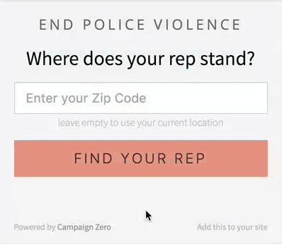

Campaign Zero Widget
===

[](https://raw.githubusercontent.com/campaignzero/campaign-zero-widget/master/LICENSE)  [](https://github.com/campaignzero/campaign-zero-widget/graphs/contributors)




* [CLICK HERE TO DEMO THE WIDGET](https://www.ourstates.org/action)

<script async src="https://embed.joincampaignzero.org/widget.js" charset="utf-8" data-widget-type="resistance" data-widget-title-text="ADVOCACY TOOL" data-widget-subtitle-text="Make your voice heard" data-widget-button-text="FIND MY REPS" data-widget-pick-rep-text="FIND YOUR REP" data-widget-email-body="[Insert the issue you want your rep to take action on below. To give you an idea for what an effective call to action looks like we've provided a sample email here focused on addressing police violence]
My name is [insert name], I'm in your district, and I urge you to support [bill number] to require a special prosecutor to hold police accountable for police shootings."></script>

About The Data
---

This Widget gets it's Elected Official data from the __[Civil Services API](https://github.com/civilserviceusa/api)__. 

The specific bills we keep track of are managed internally by our team.

Currently, the widget covers all state and federal representatives and the largest US cities. Legislator vote history is currently available for state legislators only; spanning issues of policing, gun violence, economic justice, reproductive justice, LGBTQ equality, immigration, voting rights, and healthcare. Note that the "Resistance" setting displays bills for all of these issues and "Default" displays bills on policing only.


Usage Instructions
---

To use this script, you simply need to add the following code anywhere on your website that you want the widget to show up:

```html
<script async src="https://embed.joincampaignzero.org/widget.js" charset="utf-8"></script>
```

This will inject a widget into a newly created HTML element with the ID `campaign-zero-widget` directly above where you placed our script.


Alternate Usage Instructions
---

If you are unable to place JavaScript where you want the widget to go, you can use the following HTML directly:

```html
<div id="campaign-zero-widget"></div>
```

Then, include the following script tag anywhere else on your page:

```html
<script async src="https://embed.joincampaignzero.org/widget.js" charset="utf-8"></script>
```

If you are using something like WordPress that just asks you for the URL for the script to put in your footer, you can use the following URL:

```
https://embed.joincampaignzero.org/widget.js
```

__NOTE__:  We no longer recommend the use of iFrames as they have proven to be be unreliable on most websites.


Customize Widget
---


You can add one or all of the following Data Attributes on either our `<script>` or `<div id="campaign-zero-widget">` Element to customize the text:

Data Attribute                     | Default                                                                                                                                    | Description
-----------------------------------|--------------------------------------------------------------------------------------------------------------------------------------------|-------------
`data-widget-type`                 | `default`                                                                                                                                  | This should be either `default` or `resistance` depending on which data source you want to use (the Default setting shows policing bills only, Resistance shows all issue areas)
`data-widget-title-text`           | End Police Violence                                                                                                                        | This is the Title at the Top of the Widget
`data-widget-subtitle-text`        | Where does your rep stand?                                                                                                                 | This is the Call to Action Text above the Search Field
`data-widget-button-text`          | Find your rep                                                                                                                              | The is the Button on the Main Page
`data-widget-pick-rep-text`        | Pick a Representative                                                                                                                      | This is the Text at the top of the page after doing a search
`data-widget-call-action-text`     | Call and demand action:                                                                                                                    | This is the Text above the Phone Number List
`data-widget-email-action-text`    | Email and demand action:                                                                                                                   | This is the Text above the Email List
`data-widget-email-subject`        | We need urgent action to end police violence in our district.                                                                              | This is the Email Subject for Contacting an Elected Official
`data-widget-email-greeting`       | Greetings                                                                                                                                  | This is the word before the Elected Official's name, e.g. `Greetings Jane Doe,`
`data-widget-email-body`           | I'm from your district, and police violence needs to be urgently addressed through comprehensive legislation as proposed by Campaign Zero. | This is the Body of the Email for sent to the Elected Official
`data-widget-email-action`         | [YOUR_MESSAGE_HERE]                                                                                                                        | This is text at the end of the Email Body where you can encourage the user to add their own message
`data-widget-twitter-text`         | Learn where your representatives stand on police violence and demand action now! http://JoinCampaignZero.org/action                        | This is the Message in Tweet
`data-widget-twitter-hashtags`     | CampaignZero                                                                                                                               | These are the Hashtags used in the Tweet, you can use more than one by using a comma between words
`data-widget-facebook-link`        | http://www.joincampaignzero.org/action                                                                                                     | This is the URL you want to link to for the Facebook Post
`data-widget-facebook-description` | Learn where your representatives stand on police violence and demand action now!                                                           | This is the Description you want shown for the Facebook Post

### Samples:

```html
<div id="campaign-zero-widget" data-widget-title-text="Custom Title" data-widget-subtitle-text="Custom Subtitle" data-widget-button-text="Custom Button" data-widget-pick-rep-text="Custom Rep Header"></div>
```

```html
<script async src="https://embed.joincampaignzero.org/widget.js" charset="utf-8" data-widget-title-text="Custom Title" data-widget-subtitle-text="Custom Subtitle" data-widget-button-text="Custom Button" data-widget-pick-rep-text="Custom Rep Header"></script>
```
